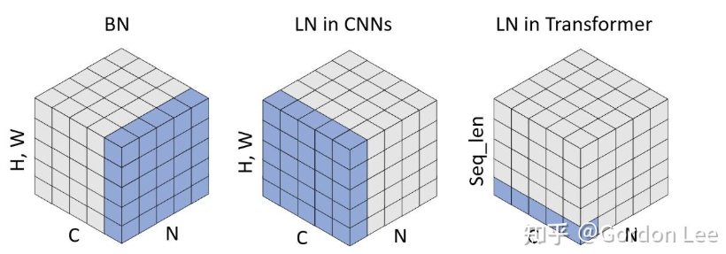
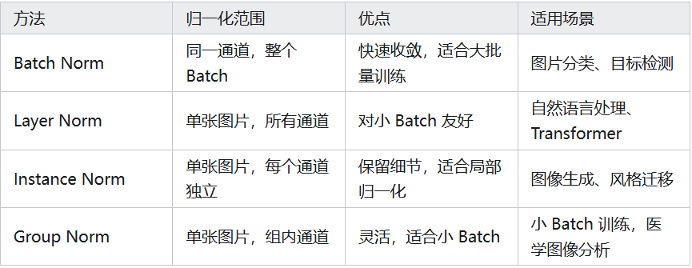
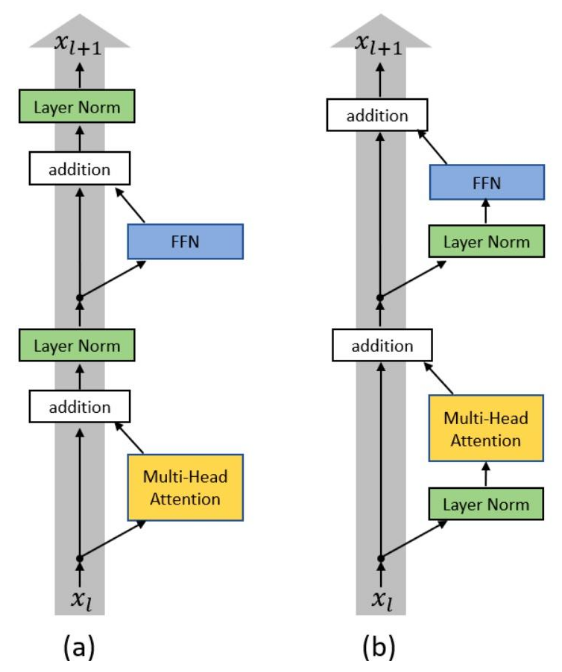

<!-- # Sharing_Coding_2025.12

Coding part of the sharing meeting in LPAI, about Normalization in Neural Networks. -->

# 代码分享--归一化（Normalization） 2025.12 

### 核心方法

* $\hat{X} = \frac{X-\mu}{\sqrt{\sigma+\epsilon}}$

* $Y=\gamma \hat{X}+ \beta$

$X\rightarrow^{标准化} N(0,1) \rightarrow^{训练学习 \gamma, \beta} N(\beta,\gamma^2)$ 

~~~python
def forward(x):
    # 模块计算
    module_out = module(x)
    # 归一化
    mean = batch_mean(module_out)
    var = batch_var(module_out)
    x_hat = (module_out - mean) / sqrt(var + eps)
    bn_out = gamma * x_hat + beta
    # 激活函数
    output = relu(bn_out)
    return output
~~~

### 方法对比

1. BatchNorm (BN)
2. LayerNorm (LN)
3. InstanceNorm (IN)
4. GroupNorm (GN)

5. RMSNorm (Root Mean Square Norm)

* $\hat{X} = \frac{X}{\sqrt{\frac{1}{n}\sum(x^2)+\epsilon}}$
* $Y=\gamma \hat{X}$

* 优点：计算高效，内存消耗少。被一些研究表明是LayerNorm的有效替代品
* 典型场景：追求效率的 LLM，例如LLaMA、Gemma等模型

### 架构方式

1. Post-Norm
* $y=norm(M(x)+x)$
* 经典设计，极限性能可能更优

2. Pre-Norm 
* $y=M(norm(x))+x$
* 现代 LLM 主流，更加稳定，易加深模型

[代码 Demo](Demo.py)
